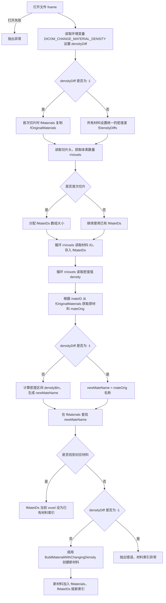

ReadPhantomDataFile函数逻辑

```mermaid
flowchart TD
  A["打开文件 fname"] -->|打开失败| B["抛出异常"]
  A --> C["读取环境变量 DICOM_CHANGE_MATERIAL_DENSITY 设置 densityDiff"]
  C --> D{"densityDiff 是否为 -1"}
  D -->|是| E["首次切片时 fMaterials 复制 fOriginalMaterials"]
  D -->|否| F["所有材料设置统一的密度差 fDensityDiffs"]

  E & F --> G["读取切片头，获取体素数量 nVoxels"]
  G --> H{"是否首次切片"}
  H -->|是| I["分配 fMateIDs 数组大小"]
  H -->|否| J["继续使用已有 fMateIDs"]

  I & J --> K["循环 nVoxels 读取材料 ID，存入 fMateIDs"]

  K --> L["循环 nVoxels 读取密度值 density"]
  L --> M["根据 mateID 从 fOriginalMaterials 获取原材料 mateOrig"]

  M --> N{"densityDiff 是否为 -1"}
  N -->|否| O["计算密度区间 densityBin，生成 newMateName"]
  N -->|是| P["newMateName = mateOrig 名称"]

  O & P --> Q["在 fMaterials 查找 newMateName"]
  Q --> R{"是否找到对应材料"}
  R -->|是| S["fMateIDs 当前 voxel 设为已有材料索引"]
  R -->|否| T{"densityDiff 是否为 -1"}
  T -->|否| U["调用 BuildMaterialWithChangingDensity 创建新材料"]
  U --> V["新材料加入 fMaterials，fMateIDs 赋新索引"]
  T -->|是| W["抛出错误，材料索引异常"]

  B & S & V & W
```

